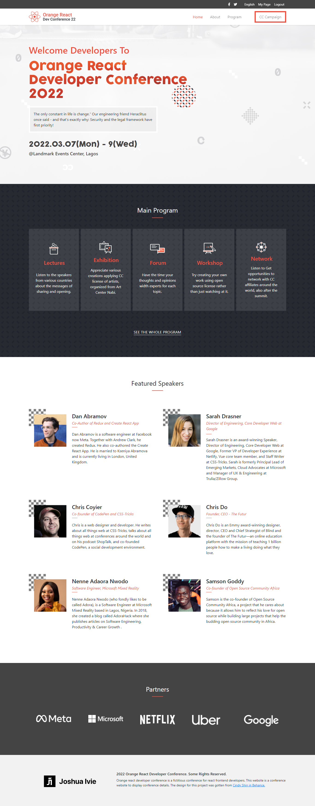

# Orange React Developer Conference

> Orange react developer conference is a fictitious conference for react frontend developers. This website is a conference website to display conference details. The design for this project was gotten from [Cindy Shin in Behance](https://www.behance.net/gallery/29845175/CC-Global-Summit-2015).

## Built With

- HTML5
- CSS3
- JavaScript
- Bootstrap 5
- JQuery
- Owl Carousel

## Live Link

You can can find a live link to the project here: [Project](https://joshuaivie.github.io/orange-react-conference/)

## Authors

👤 **Joshua Ivie**

- GitHub: [@joshuaivie](https://github.com/joshuaivie)
- Twitter: [@joshuaivie\_](https://twitter.com/joshuaivie_)
- LinkedIn: [joshuaivie](https://linkedin.com/in/joshuaivie)

## 🤝 Contributing

Contributions, issues, and feature requests are welcome!

Feel free to check the [issues page](../../issues/).

## Show your support

Give a ⭐️ if you like this project!

## 📝 License

This project is [MIT](./MIT.md) licensed.
